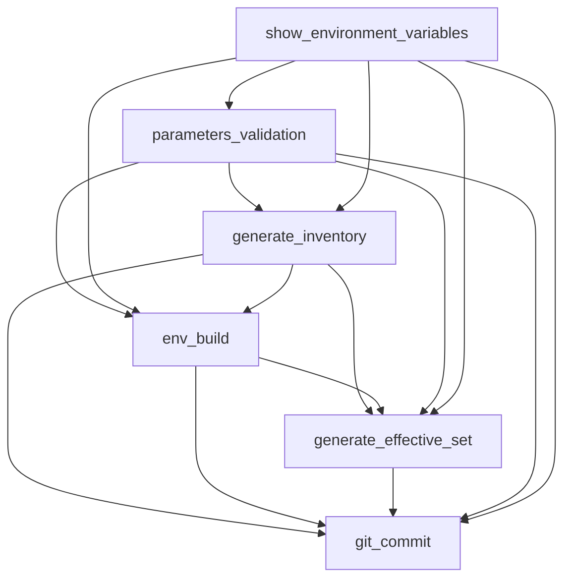

# EnvGene Execution Pipeline

## Overview

**EnvGene Execution Pipeline** is a GitHub Actions workflow for automated environment management and deployment within the Qubership system. The workflow is designed for inventory generation, environment building, effective set creation, and committing changes to the repository.

## Key Features

- **Trigger Type**: Manual (workflow_dispatch)
- **Multi-environment Support**: Yes (matrix strategy)
- **Artifact Passing**: Between jobs
- **Conditional Execution**: Yes
- **Docker-based**: All jobs run in containers

## Input Parameters

### Required Parameters

| Parameter | Type | Description |
|-----------|------|-------------|
| `ENV_NAMES` | string | List of environment names (comma-separated) |
| `ENV_TEMPLATE_VERSION` | string | Environment template version |
| `ENV_BUILDER` | choice | Enable environment build (true/false, default: true) |
| `GET_PASSPORT` | choice | Get passport (true/false, default: false) |
| `CMDB_IMPORT` | choice | CMDB import (true/false, default: false) |

### Optional Parameters

| Parameter | Type | Description |
|-----------|------|-------------|
| `DEPLOYMENT_TICKET_ID` | string | Deployment ticket ID |

## Docker Images

The workflow uses the following Docker images:

- **GCIP**: `ghcr.io/netcracker/qubership-gcip:latest`
- **EnvGene**: `ghcr.io/netcracker/qubership-envgene:feature-enchance_instance_pipeline`
- **Effective Set Generator**: `ghcr.io/netcracker/qubership-effective-set-generator:latest`

## Jobs Architecture

### 1. Input Parameters Processing (`show_environment_variables`)

**Purpose**: Process input parameters and create environment matrix

**Execution**: Always

**Functions**:
- Load and validate input parameters
- Create environment matrix for parallel execution
- Generate ENV_GENERATION_PARAMS
- Output pipeline configuration

**Outputs**:
- `env_matrix` - environment matrix
- All main configuration parameters
- Docker images

### 2. Parameters Validation (`parameters_validation`)

**Purpose**: Validate parameters for each environment

**Execution**: After `show_environment_variables`

**Dependencies**: `show_environment_variables`

**Functions**:
- Check environment parameter correctness
- Validate EnvGene configuration

### 3. Generate Inventory (`generate_inventory`)

**Purpose**: Generate environment inventory

**Execution Condition**: 
```yaml
ENV_TEMPLATE_TEST == 'false' && 
(ENV_SPECIFIC_PARAMETERS != '' || ENV_TEMPLATE_NAME != '')
```

**Dependencies**: `parameters_validation`, `show_environment_variables`

**Functions**:
- Generate inventory based on environment parameters
- Create directory structure
- Prepare artifacts for next stages

**Artifacts**: `generate_inventory_<SANITIZED_NAME>`

### 4. Environment Build (`env_build`)

**Purpose**: Build environments

**Execution Condition**: `ENV_BUILDER == 'true'`

**Dependencies**: `parameters_validation`, `show_environment_variables`, `generate_inventory`

**Functions**:
- Download artifacts from previous stages
- Execute Ansible playbooks for environment build
- Configure template versions
- Process test environments

**Artifacts**: `env_build_<SANITIZED_NAME>`

### 5. Generate Effective Set (`generate_effective_set`)

**Purpose**: Generate effective set for environments

**Execution Condition**: `GENERATE_EFFECTIVE_SET == 'true'`

**Dependencies**: `parameters_validation`, `show_environment_variables`, `generate_inventory`, `env_build`

**Functions**:
- Create effective set configurations
- Process deployment parameters
- Prepare final configurations

**Artifacts**: `generate_effective_set_<SANITIZED_NAME>`

### 6. Git Commit (`git_commit`)

**Purpose**: Commit changes to repository

**Execution Condition**: Any of the previous stages executed
```yaml
ENV_INVENTORY_INIT == 'true' || 
ENV_BUILDER == 'true' || 
GENERATE_EFFECTIVE_SET == 'true'
```

**Dependencies**: All previous jobs

**Functions**:
- Download final artifacts
- Configure Git settings
- Commit changes to repository
- Create final artifacts

**Artifacts**: `git_commit_<SANITIZED_NAME>`

## Workflow Dependencies



## Implementation Features

### Matrix Strategy
The workflow supports processing multiple environments in parallel through matrix strategy, where each environment is processed in a separate job instance.

### Artifact Management
- Each job creates named artifacts
- Artifacts are passed between dependent jobs
- Uses naming convention `<job_name>_<SANITIZED_NAME>`

### Conditional Execution
Jobs execute based on:
- Pipeline input parameters
- Results of previous stages
- Special conditions (e.g., for generate_inventory)

### Security
- Uses GitHub secrets for authentication
- Controlled access permissions
- Isolated Docker containers

## Environment Variables

### Core Variables
- `CI_COMMIT_REF_NAME` - branch name
- `CI_PROJECT_DIR` - project directory
- `SECRET_KEY` - encryption key
- `GITHUB_TOKEN` - GitHub access token

### Configuration Variables
- `CLUSTER_NAME` - cluster name
- `ENVIRONMENT_NAME` - environment name
- `ENV_TEMPLATE_VERSION` - template version
- `INSTANCES_DIR` - instances directory

## Usage

1. Navigate to the Actions section of the repository
2. Select "EnvGene Execution" workflow
3. Click "Run workflow"
4. Fill in required parameters:
   - ENV_NAMES (e.g., "test-cluster/e01,test-cluster/e02")
   - ENV_TEMPLATE_VERSION
5. Configure additional parameters as needed
6. Start the workflow

## Artifacts and Results

Upon workflow completion, the following artifacts are created:
- Environment configurations
- Effective sets
- Inventory
- Execution logs

All changes are automatically committed to the repository upon successful execution. 