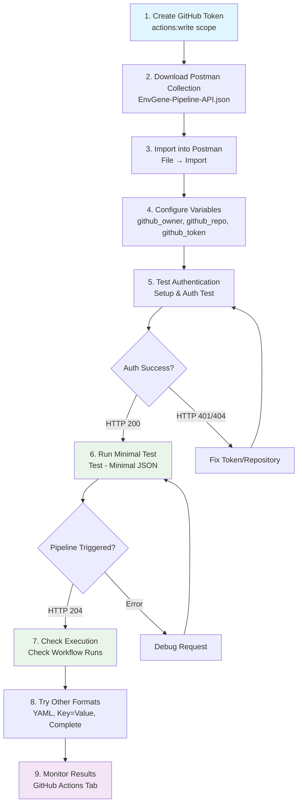

# Postman Quick Start Guide

⚡ **5-minute setup** for testing GITHUB_PIPELINE_API_INPUT

## Testing Workflow



## Step 1: Get GitHub Token
1. Go to https://github.com/settings/tokens
2. Click "Generate new token (classic)"
3. Select `actions:write` scope
4. Copy the token

## Step 2: Import Collection
1. Download: [EnvGene-Pipeline-API.postman_collection.json](../postman/EnvGene-Pipeline-API.postman_collection.json)
2. Open Postman → Import → Select file
3. Collection imported ✅

## Step 3: Configure Variables
1. Click on collection → Variables tab
2. Set values:
   ```
   github_owner = your-username
   github_repo = your-repo-name  
   github_token = ghp_xxxxxxxxxxxx
   github_branch = main
   ```

## Step 4: Test!

### Test 1: Basic Auth ✅
- Run: "Setup & Auth Test"
- Expected: HTTP 200 with workflow list

### Test 2: Minimal API Call ✅
- Run: "Test - Minimal JSON"
- Expected: HTTP 204 (workflow triggered)

### Test 3: Check Execution ✅
- Run: "Check Workflow Runs"
- Expected: Your workflow in the list

## Ready Requests

| Request | Purpose | Format |
|---------|---------|---------|
| Setup & Auth Test | Verify credentials | - |
| Test - Minimal JSON | Basic functionality | JSON |
| Test - Complete JSON | All parameters | JSON |
| Test - YAML Format | YAML input | YAML |
| Test - Key=Value Format | Simple format | Key=Value |
| Test - Dynamic Generation | Auto-generated data | JSON |
| Check Workflow Runs | Monitor execution | - |

## Quick Examples

### Minimal Request Body:
```json
{
  "ref": "main",
  "inputs": {
    "GITHUB_PIPELINE_API_INPUT": "{\"ENV_NAMES\": \"test-cluster/e01\", \"ENV_INVENTORY_INIT\": \"true\"}"
  }
}
```

### YAML Format:
```json
{
  "ref": "main", 
  "inputs": {
    "GITHUB_PIPELINE_API_INPUT": "ENV_NAMES: \"test-cluster/e01\"\nENV_INVENTORY_INIT: true"
  }
}
```

## Troubleshooting

| Issue | Solution |
|-------|----------|
| HTTP 401 | Check token permissions |
| HTTP 404 | Verify repository path |
| HTTP 422 | Ensure workflow file exists |
| No trigger | Check `ENV_NAMES` parameter |

🎉 **You're ready to test!** 